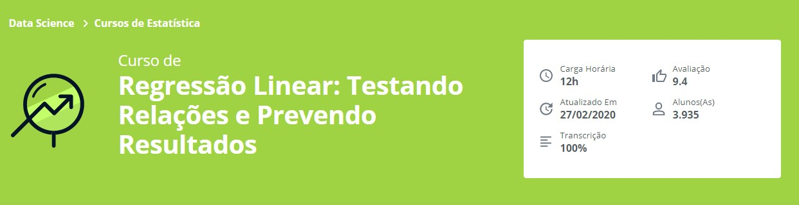

Repositório de desenvolvimento referente ao **Curso de Regressão Linear: Testando Relações e Prevendo Resultados - Alura**

## Aprendido no curso
* Utilize visualizações para entender a distribuição de seus dados
* Descubra a diferença entre variáveis dependentes e explicativas em seus dados
* Aprenda a separar dados de treino e teste
* Modele com regressões lineares
* Entenda os erros em função dos resíduos e métricas
* Compare e salve os melhores modelos

## Link para o Curso 
https://cursos.alura.com.br/course/data-science-modelo-regressao-linear
